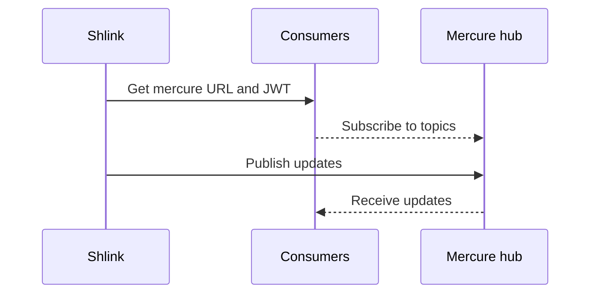

import { Callout } from '../../../components/Callout';
import { Link } from '../../../components/Link';
import { markdownComponents } from '../../../utils/markdownUtils';

export const components = markdownComponents

## Real-time updates

Once your Shlink instance is set up, you may want to enable real-time updates to notify third parties when certain events occur.

Currently, Shlink supports the next technologies to publish updates.

* [Mercure hub](/documentation/advanced/real-time-updates#mercure-hub-server): allows to subscribe to server-sent events. *(Since v2.2.0)*.
* [RabbitMQ](/documentation/advanced/real-time-updates#rabbitmq-server): to publish server-to-server updates *(Since v2.10.0)*.
* [Redis pub/sub](/documentation/advanced/real-time-updates#redis-pub-sub): to publish server-to-server updates *(Since v3.2.0)*.
* [Webhooks](/documentation/advanced/real-time-updates#webhooks): will be called with new visits.

<Callout type="warning">
    Real-time updates only work when [openswoole](/documentation/supported-runtimes/serve-with-openswoole/) or [RoadRunner](/documentation/supported-runtimes/serve-with-roadrunner/), which is the case if you are using the <Link href="/documentation/install-docker-image">docker image</Link>.
</Callout>

### Topics and payloads

Regardless the technology used for publishing and subscribing to updates, the whole list of supported topics, together with their payloads can be found in Shlink's [Async API spec](https://api-spec.shlink.io/async-api) page.

### Mercure hub server

The best option if you want to get real-time updates on a client-side web app, is by taking advantage of the integration with a [mercure](https://mercure.rocks) hub server.

Mercure provides server-sent events, so that consumers can subscribe to topics and get automatically notified when Shlink publishes an update for any of them.

#### Configure the mercure hub server

The mercure hub server will act as an intermediary between Shlink, which will publish updates on it, and consumers, which will subscribe to those updates and get notified by the hub.

The first thing you need to do is [install the mercure hub](https://mercure.rocks/docs/hub/install) server. There's both a prebuilt dependency-less binary, and a docker image, which is the best option to use together with Shlink's docker image.

Then you need to provide some config options to the mercure hub for the integration to properly work:

##### For new mercure versions (since 0.11):

* `SERVER_NAME`: This env var should have the value `":80"`, in order to disable https. Just make sure you [serve mercure behind a reverse proxy](https://mercure.rocks/docs/hub/cookbooks#using-nginx-as-an-http-2-reverse-proxy-in-front-of-the-hub), and enable https there.
* `MERCURE_PUBLISHER_JWT_KEY` and `MERCURE_SUBSCRIBER_JWT_KEY`: The same value provided to Shlink should be used for these two env vars, otherwise, the JWTs generated by Shlink will be rejected by mercure and neither publishing nor subscribing will be possible.
* `MERCURE_EXTRA_DIRECTIVES`: if you want to consume updates from a browser web app (like shlink-web-client), this option should have the directive `cors_origins` followed by the domain/s from which you plan to consume mercure (for example `cors_origins https://app.shlink.io`), otherwise, it will reject the connection.

##### For legacy mercure versions (before 0.11 or using *legacy* prefix):

* `--jwt-key`|`JWT_KEY`: The same value provided to Shlink should be used here, otherwise, the JWTs generated by Shlink will be rejected by mercure and neither publishing nor subscribing will be possible.
* `--cors-allowed-origins`|`CORS_ALLOWED_ORIGINS`: if you want to consume updates from a browser web app (like shlink-web-client), this option should have the domain/s from which you plan to consume mercure (for example `"https://app.shlink.io"`), otherwise, it will reject the connection.

#### Interaction between the parts

Once installed, this is how Shlink, the mercure hub and consumers will interact:



* Shlink knows Mercure hub's public URL and the JWT secret key.
* Shlink can generate JWTs for mercure, which only have permission for subscribing.
* Shlink publishes updates to mercure when something needs to be notified to consumers.
* Consumers get valid JWTs and the hub URL from Shlink's REST API, by calling `GET /rest/v2/mercure-info`.
* Consumers subscribe to topics on the mercure hub using the JWT returned on previous request.
* If the JWT expires, consumers can call the endpoint as many times as they need to get new JWTs.

This flow ensures the JWT key is never leaked by accident, and you need to have a valid Shlink API key in order to get valid JWTs for mercure.

Also, JWTs returned to consumers will only have permission to subscribe to updates. Only Shlink will be able to publish updates.

<Callout type="info">
    If you use shlink-web-client to interact with your Shlink instance, it will work out of the box and consume updates from mercure, updating the UI in real-time where applicable.
</Callout>

### RabbitMQ server

Starting with v2.10.0, Shlink supports publishing updates in a [RabbitMQ](https://www.rabbitmq.com/) server, which is a widely used technology for publishing and subscribing to server-to-server updates.

#### Configure the RabbitMQ server

The RabbitMQ server will act as an intermediary between Shlink, which will publish updates on it, and consumers, which will subscribe to those updates and get notified in real-time.

There are several ways to install RabbitMQ. The best option is to follow the [official documentation](https://www.rabbitmq.com/download.html).

Once the server is configured, you can provide the integration config to Shlink via [installation tool](/documentation/command-line-interface/installation-tool) or [env vars](/documentation/environment-variables#rabbitmq-integration).

#### Exchanges and queues

Shlink will create an exchange with its corresponding queue, for every operation defined in Shlink's [Async API spec](https://api-spec.shlink.io/async-api/).

The exchanges and queues are created in a "durable" way, with "direct" publishing type.

### Redis pub/sub

Since Shlink v3.2.0, if you configured a redis server/cluster for caching, Shlink can also use that instance for real-time updates via redis pub/sub.

When this happens, the redis server/cluster will act as an intermediary where Shlink publishes the updates, and others can subscribe to them.

### Webhooks

<Callout type="warning">
  As of Shlink 3.1.0, webhooks are considered <b>deprecated</b>, since any new kind of update is by definition a breaking change, and they provide less flexibility than standard queuing systems.

  Because of this, only visits and, optionally, orphan visits, will be notified to webhooks.

  For a fully featured, real-time subscription to Shlink events, consider using any of the other options.
</Callout>

Shlink supports providing a comma-separated list of endpoints, via [env vars](/documentation/environment-variables#webhooks-integration) or [installation tool](/documentation/command-line-interface/installation-tool), which will receive a `POST` request from Shlink when a short URL is visited.

The body of the request will contain the payload of both the `shortUrl` that was visited, and the `visit` with the geolocation, like this:

```json
{
  "shortUrl": {
    "shortCode": "12C18",
    "shortUrl": "https://s.test/12C18",
    "longUrl": "https://store.steampowered.com",
    "dateCreated": "2016-08-21T20:34:16+02:00",
    "visitsCount": 328,
    "tags": [
      "games",
      "tech"
    ],
    "meta": {
      "validSince": "2017-01-21T00:00:00+02:00",
      "validUntil": null,
      "maxVisits": 100
    },
    "domain": null
  },
  "visit": {
    "referer": "https://t.co",
    "date": "2015-08-20T05:05:03+04:00",
    "userAgent": "Mozilla/5.0 (X11; Linux x86_64) AppleWebKit/537.36 (KHTML, like Gecko) Chrome/51.0.2704.103 Safari/537.36",
    "visitLocation": {
      "cityName": "Cupertino",
      "countryCode": "US",
      "countryName": "United States",
      "latitude": 37.3042,
      "longitude": -122.0946,
      "regionName": "California",
      "timezone": "America/Los_Angeles"
    }
  }
}
```

<Callout type="info">
  Starting with Shlink v2.9.0, you can also enable sending requests for orphan visits. In that case, the <b>shortUrl</b> prop won't be present.

  This option is disabled by default for backwards compatibility reasons, so you need to actively opt-in.
</Callout>
